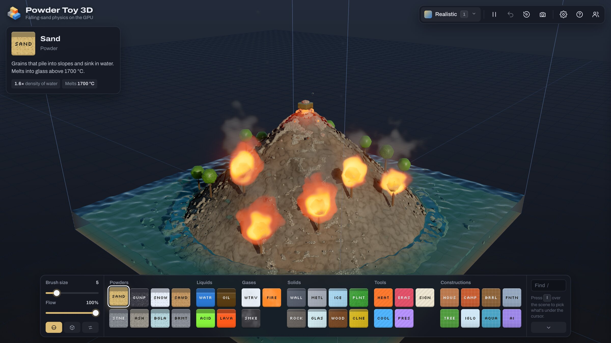

# Powder Toy 3D

**Play it in your browser: [tpt3d.codyh.xyz](https://tpt3d.codyh.xyz)**

[](https://tpt3d.codyh.xyz)

A GPU-native, 3D falling-sand sandbox in the spirit of The Powder Toy, built on three.js (WebGL2).
Every cell of a 128³ grid (2.1M cells, up to 160×96×160) is simulated and raymarched on the GPU, at ~240 sim steps/s.

```sh
npm install
npm run dev        # http://localhost:5173  (?preset=lab|volcano|empty&size=64|96|128|wide|world)
```

## Controls

Press `?` in the app for the full list.

| Painting | |
|---|---|
| Left-drag | paint with the selected element or tool (the brush stays at the height where you clicked) |
| `[` `]` or Shift + scroll | brush size |
| `B` / `X` | sphere or cube brush / paint over existing material |
| `I` | eyedropper: pick the element under the cursor (or click the Eyedropper in the dock, then click the scene) |
| ⌘Z / Ctrl+Z | undo the last stroke, clear or scene change |
| `/` | find an element |

| Camera | |
|---|---|
| Right-drag or ⌥-drag | orbit |
| Shift + right-drag or middle-drag | pan |
| Scroll | zoom |
| `W` `A` `S` `D`, `Q` `E` | move, turn left/right (hold Shift to go faster) |
| `R` | reset the camera |
| `F` | drop into the world as a person, or pop back out |

| Everything else | |
|---|---|
| Space / `.` | pause / step one frame |
| `1`–`5` | switch view |
| `T` | show or hide the element dock |
| `,` | settings |
| `P` | save a screenshot |

Hovering shows the element, temperature and air pressure under the cursor. Settings are remembered between visits.

## First person

Press `F` to drop a body onto the surface under the cursor. The camera swoops down into its eyes and the world stays
running around you. You're about 5½ cells tall (one cell is roughly 30 cm), so a lava flow is a river and a house is
a building. `F` again swoops back out.

The body is as mortal as a sand grain. You float or sink by density (hold Space to keep your head out of water),
blasts throw you along the pressure gradient, and heat, lava, cold, acid, drowning, being buried and hard landings
hurt. When you die, the camera pulls back and shows what killed you, then you respawn where you dropped in.

| In first person | |
|---|---|
| Mouse | look (click to capture the mouse, Esc to release it) |
| `W` `A` `S` `D`, Shift | walk, sprint |
| Space / `C` | jump or swim up / swim down |
| Left / right click | use the tool / its second action |
| `1`–`5` or scroll | pick a tool |
| `V` | first or third person |

The tools are physical and finite. Infinite painting stays in the god view.

1. **Shovel:** digs a load of powder, or breaks solids into their debris (slower the harder they are). Right-click
   dumps the load where you aim.
2. **Bucket:** scoops a load of liquid, and right-click pours it. A bucket of lava stays hot.
3. **Axe:** a short, wide swing that chops wood and smashes glass, ice and plants.
4. **Gun:** fires a metal round at 360 m/s under real gravity, so it crosses the whole box with a few cm of drop.
   The round flies outside the sim (a GPU trace checks its path each frame) and becomes a real slug cell where it
   hits, so the engine decides what breaks: glass shatters, metal holds, a keg goes off. Recoil is a real round's: a
   nudge, not a launch.
5. **Physgun:** a force beam on loose matter. Hold to carry a floating ball of water or sand, right-click to fling it.

Nothing a tool carries is made up: the cells it takes come back out exactly (same element, temperature and state).

Everything you do makes a sound (synthesised with [ZzFX](https://github.com/KilledByAPixel/ZzFX) and placed in 3D):
impacts sound like the material they hit, pitched by its hardness, and the world goes muffled under water. Shots
kick the camera, nearby blasts and hard landings shake it, and [three.quarks](https://github.com/Alchemist0823/three.quarks)
draws the muzzle flash, sparks, dust and tracers. The held tools are low-poly and flat-shaded in the RuneScape style, and
**Settings → First person** picks the body: the stickman, or a realistic one animated with
[Quaternius](https://quaternius.com)'s CC0 animation library.

## World

**Settings → Grid size → World** swaps the box for a whole island: 1024 × 128 × 1024 cells (about 300 m across),
generated from a seed with hills, cliffs, beaches, meadows, forests and rock peaks. Only a 128³ window around you
is simulated (the orbit target in the god view, your body in first person), and it slides along 16 cells at a time
as you move. Whatever you change stays changed: the bricks you leave behind are compressed and kept, and they come
back when you return, so a house you built or a crater you blew is still there. Painting, tools, signs and undo
work inside the window. Multiplayer doesn't work in World yet. Picking a scene goes back to a box.

## Elements

The dock groups elements like a periodic-table strip, each tile in the element's colour with a TPT-style abbreviation:

- **Powders:** SAND, STNE, GUNP, ASH, SNOW, BGLA (broken glass), SAWD (sawdust), BRMT (scrap metal)
- **Liquids:** WATR, ACID, OIL, LAVA
- **Gases:** WTRV (steam), SMKE, FIRE
- **Solids:** WALL, METL, GLAS, ICE, WOOD, PLNT, CLNE
- **Tools:** HEAT, COOL, ERAS, PRES (pressure), SIGN
- **Constructions:** HOUS (cottage, log cabin, brick, greenhouse), TREE (oak, pine, birch, palm, willow, dead), CAMP, IGLO, BRRL (oil drum, powder keg), AQUA, FNTN, AI (your own, written by a model or pasted)

All element properties live in one table (`src/elements.js`) that is baked into the shaders as GLSL constants.
The rules around them (latent heats, pressure diffusion, collision restitution, tool strengths...) live in `src/physics.js`,
which reaches the shaders as `#define`s.

Each element tile is a tiny live scene. Hover it and a CPU port of the same engine (`src/ui/tiles/`) runs a small box of that element,
with the same table, the same constants from `src/physics.js`, and the game's gravity, speed and flow settings.
The cursor uses the game's own tools: Pressure on powders and liquids, the element's own brush on gases, and Heat on solids.
A new element with only a table row needs nothing else. One that gets its own special case in the GPU passes needs the same case
in `src/ui/tiles/engine.js`; `node scripts/check-tile-engine.mjs` lists any that are missing.

## Constructions

Constructions are whole structures placed with one click (`src/constructions.js`). Unlike TPT's stamps they are generators:
each one is built from a seed, a size (the brush size) and a variant, so every tree is different. With *Shuffle* selected a
random variant is picked per placement, and *New seed* rolls a different one. A ghost of the exact model follows the cursor
and turns its front (the door) toward the camera.

They are made of ordinary elements and behave like them: wooden walls burn, the stone chimney draws smoke up from the fireplace,
an igloo melts, a powder keg goes off. Placing one uploads it as a small 3D texture that a single GPU pass (`src/shaders/stamp.js`)
writes into the grid. Solid bases grow a footing straight down to the first thing that can bear weight (up to 32 cells), so a house
on a ledge gets a plinth and one in a lake stands on stilts.

Every construction is a small program written against one API (`src/constructions/runtime.js`: `put`, `box`, `ball`, `disc`,
`rod`, ...). The built-ins in `src/constructions/builtins.js` use it, and so can a model, a chatbot or a coding agent:

- **AI tile:** describe a construction and *Generate* asks a model to write it. The model's code runs in a sandboxed worker
  (no network, 5 s limit) and is checked by a physics lint (`src/constructions/lint.js`: liquid that can leak through
  diagonal gaps, unsupported powder, clones with no source). The report and two pictures go back to the model until the build
  is clean. Models come through the Vercel AI SDK with your own key (`src/ai/providers.js`): OpenRouter (with *Sign in with
  OpenRouter*), Anthropic, OpenAI, Google, or a local model through Ollama, LM Studio or any OpenAI-compatible server. Keys
  stay in your browser. Without a key, *Copy prompt* gives a prompt for any chatbot and *Paste code* runs its reply.
  Subscriptions (Claude, ChatGPT, Gemini) work through the MCP server below. Your constructions are saved, and export and
  import as `.json`.
- **Accounts:** the default model, *Powder Toy AI (free)*, goes through the relay's OpenAI proxy (`relay/ai.js`): one
  generation a day without an account, 10 a day signed in with Google, 100 on the paid plan. The relay runs the
  sign-in (`relay/auth.js`) and sends the page back with a session token in the URL fragment; `src/account.js` keeps it in
  localStorage (no cookies) and sends it as `Authorization: Bearer` to `/auth/*` and the AI proxy. A random nonce in the
  return URL and in sessionStorage means a token only counts in the tab that asked for it. *Settings → Account* signs
  out or deletes the account, and [public/privacy.html](public/privacy.html) says what's stored. Against a local relay
  (`npm run relay`) there's also *Dev sign-in*, which skips OAuth; it needs `AUTH_DEV=1` in `relay/.dev.vars`.
- **Coding agents:** `npm run construct -- my-thing.js --png out.png` runs code headlessly and prints the lint report;
  `npm run construct -- --builtins` lints every built-in; `npm run mcp:construct` serves the same tools over MCP.
  See [docs/constructions.md](docs/constructions.md).

## How the physics works

Per simulation step there are three GPU passes over the state (two RGBA32F textures in a brick-major 2D atlas: each 4×4×4 brick is an 8×8-texel tile, see `src/shaders/common.js`):

**1. Movement: a Margolus block cellular automaton** (`src/shaders/move.js`).
The grid is split into 2×2×2 blocks whose partition shifts by one cell every step.
Each block is solved once (one fragment per block, written to 8 MRT attachments as "which cell lands here and with what velocity").
A gather pass then rebuilds the grid. Blocks only permute their cells, so mass is conserved exactly
and two particles can never race for the same cell, which is the usual problem with GPU falling sand.

Movement is velocity-driven. Each particle carries a velocity (cells/step) and tries to move along each axis with probability |v|.
Density decides whether it can displace its neighbour, so sand sinks through water, oil floats, steam bubbles up, and snow and ash float.
- Collisions between particles exchange momentum (density as mass, restitution 0.3), so impacts and blasts travel through piles.
  Slow contact acts as support.
- Blocked powders topple diagonally, which gives conical piles. Grains only feel friction while resting on something.
- Falling liquids turn their momentum into sideways splash. Liquid with a hydrostatic head keeps flowing until it levels out.
  Thin films on dry ground feel surface tension (cohesion toward neighbouring liquid), so they gather into puddles with clean edges.
- Gases are buoyant and brownian. Trapped gas slides along ceilings.

**2. React** (`src/shaders/react.js`): everything local.
- **Heat conduction** uses a symmetric pairwise flux (`min(cond_a, cond_b)·ΔT`) divided by volumetric heat capacity, so energy is conserved.
  Conductances are in realistic ratios: air insulates (~1/60 of rock), and metal conducts.
- **Latent heat.** Water, ice, snow and steam pin their temperature at 0 °C or 100 °C while banking energy until a full latent heat
  (80 for fusion, 540 for vaporisation, in water-heat-capacity units) has been absorbed or released.
  That's why ice keeps water at 0 °C, why boiling takes a while, and why lava hitting the sea makes a burst of steam and a rock crust.
- **Convection.** Air and gases thin with temperature the way an ideal gas does, so hot air rises and carries heat,
  and smoke from a fire rises with it.
- **Combustion.** Flammables above their ignition temperature that touch air burn their fuel, release heat and spawn flames into
  neighbouring air. Fire spreads purely through temperature. Gunpowder detonates.
- **Phase changes.** Melting turns material into lava that remembers its origin: stone becomes stone again, sand becomes glass, metal becomes metal.
  Acid dissolves things, plants grow into water, and clone emits forever.
- **Air pressure.** Pressure diffuses, and a shock front also propagates one cell per step with exponential falloff, blocked by solids.
  Its gradient accelerates matter (a = −∇P/ρ), so explosions throw things and walls shield them.
- **Forces.** Gravity, buoyancy, drag and jitter.
- **Hardness and breaking.** Solids have a hardness in the sim's kinetic-energy units (½·density·speed²). A grain, drop or
  slug that runs into a solid carrying at least that much energy breaks it into debris: glass into shards, wood into
  sawdust, metal into scrap, rock into stone, ice into snow. The projectile pays the hardness out of its energy, and the
  debris flies off with its momentum, heated by the work of breaking it. Impacts that don't break anything stop the
  grain and turn its energy into heat, which is how a slug can set off a powder keg. A blast breaks a solid when the
  pressure difference across it exceeds a multiple of its hardness, so windows shatter well away from an explosion,
  rock chips only right beside one, and metal never breaks.

**3. Brush** (only while painting).

**Quiet bricks** (`src/shaders/activity.js`). Most of the box is still air or resting matter, and stepping it only
reshuffles the air's jitter. A cell is inert when stepping it could change nothing beyond the rest tolerances: air near
ambient with no wind or pressure, or matter at rest with nowhere to fall, flow or topple, nothing that reacts, and no
neighbour off its temperature by more than the tolerance. Every pass that writes the state leaves a byte of activity
flags beside each cell (its own rest test, its neighbour test as the react pass saw it, and whether it changed in a way
its neighbours' tests read), so every couple of steps the activity map decides most 4×4×4 bricks from those 64 bytes
and re-tests from the state only where something nearby changed. A brick whose 26 neighbours are inert too is skipped
by the move and react passes. A change travels at most two cells per step, so nothing can reach a skipped brick before
the next map.

## Rendering

The simulation stays a blocky cellular automaton; the renderer draws it as continuous matter.

**Render fields** (`src/shaders/fields.js`, rebuilt once per frame, never read by the sim). Each element has a *look*
(`src/gfx/materials.js`): liquids, lava, powders and natural solids (wood, plant, rock) belong to a smooth-surface channel;
smoke, steam and fire are media; wall, metal, glass and clone stay crisp voxels. Per channel, cell occupancy is
smoothed over time (so cells swapping every step don't shimmer), blurred with a per-channel Gaussian, and normalised by the
blurred weight of non-crisp cells, so walls and the floor count neither way: a one-cell water film keeps its height and
surfaces meet walls cleanly. Features the blur would dissolve (a lone drop or grain, a falling stream, a one-cell trunk)
are scaled back up next to current matter so their surface sits half a cell from the cell centre; ghosts of cells that
moved on still fade. `gfx.smoothing` (src/gfx/uniforms.js) scales every blur radius (0 = off).

**Tracer** (`src/shaders/render.js` + `src/shaders/gfx/*`). An Amanatides–Woo DDA walks the grid, skipping empty 4×4×4 bricks
(the brick map is built from the blurred fields, so it's dilated for free). In each cell it root-finds where a field crosses
0.5 and shades that point:
- liquids refract (the ray really bends, with total internal reflection) and reflect with Fresnel: the sky, plus the
  scene itself at grazing angles, traced through the grid; faint wind ripples keep open water from being a perfect mirror.
  Inside, light is absorbed and scattered per colour (Beer–Lambert, `scatter` in `gfx/materials.js`), and sunlight fades
  with depth: water is clear when shallow and blue-green when deep, oil amber, acid a milky green, ice cloudy. Thin
  liquid (drops, streams) is read as a cubic B-spline instead of trilinearly, so drops are round lenses, not faceted gems;
- powders, lava and organics are opaque smooth surfaces with world-space textures and bump detail (`gfx/surface.js`), the
  material blended between neighbouring cells; lava grows a cooling crust with glowing cracks. Sliding sand carries its
  texture with it, using Portal 2's flow-map technique: the texture is pushed along a flow field of how fast grains have
  actually been moving (`moveFlowFrag` in `shaders/move.js`), in two crossfaded layers that reset in turn so it never
  stretches. Still piles have no flow, so their texture stays put;
- crisp voxels get rounded edges where they're exposed;
- smoke, steam and fire are density volumes (`gfx/media.js`), sampled on a jittered lattice along the ray with sub-cell
  noise that curls and frays them and rises with the gas, so a lone cell is a faint wisp, not a sprite. They scatter
  sunlight forward (Henyey–Greenstein, plus multiple-scattering octaves), shade themselves, and are lit by the sky and
  the glow; flames are soot sheets in rising tongues that emit blackbody light, hotter in the core.

**Light** (`src/shaders/gfx/lighting.js`, `src/gfx/sky.js`, `src/shaders/gi.js`). The sky is a clear-sky atmosphere
(single Rayleigh and haze scattering, integrated in closed form along the view ray) that also sets the sun's colour, warmer
as it sinks. Day turns to night as the simulation runs (`src/gfx/daylight.js`: one day is 72,000 steps, about five
minutes at the default speed, and it holds still while paused; Settings → Lighting sets the time); after sunset a full moon lights the scene through the same
sky, dimmed and shifted blue the way a night-adapted eye sees it. A per-frame voxel shadow map is traced from the sun with the same surfaces. It records the opaque depth plus
optical depth through liquids, glass and gas, so water casts tinted shadows and smoke casts soft ones. Shadows soften with
distance from their caster (PCSS: the sun is a disc); at a contact edge within a texel, an exact DDA ray toward the sun
settles it. Indirect light comes from one probe per 4×4×4 brick: every frame, rays from the probes march the brick map and
collect the sky, the ground and the light bounced off lit matter (fed back over frames, so bounces add up), stored as L1
spherical harmonics with the sky's visibility. Surfaces take their ambient light and blurry reflections from the probes,
plus near-field occlusion from the fields; polished ones still see the sky itself where it is open.
Three upgrades sit on top, each switchable in Settings → Lighting (all on by default). Contact shadows and bounce: two
short rays per pixel walk the voxel grid; a ray that hits matter within six cells sees that matter's own sunlit, probe-lit
colour, and one that escapes falls back to the probes. Caustics: where the shadow map says a point lies under a pool,
the ripple height field's curvature focuses the sunlight reaching it (crests brighten, troughs spread), blurred with
depth by the sun's disc. Lava and fire as lights: each pixel picks one nearby emitting brick, weighted by its power over
distance², and traces a shadow ray to it, so the glow gets a direction and casts shadows.

**Glow.** Anything above ~500 °C glows (`src/gfx/incandescence.js`): the colour is Planck's law through the CIE colour matching functions, the brightness is the
physical luminance compressed by a power law, so steel reads dull red at 600–700 °C, cherry to orange at 800–1000 °C and
molten rock outshines daylight. Surfaces emit what they don't reflect (Kirchhoff), and the open skin of hot rock runs cooler
than its cracks; hot steel grows a patchy black scale. Exposed hot faces feed a coarse light volume that lights the
surroundings. The raymarcher writes depth, so three.js lines and the brush composite correctly.

**Empty space** is crossed in jumps: a distance map over the bricks (`brickDistFrag` in `src/shaders/passes.js`) says
how far each empty brick is from anything, and camera, shadow, sun and reflection rays leap that whole empty cube at once.

**On demand** (`src/gfx/pacing.js`). Frames are capped at 60 per second (a 120 Hz screen would otherwise double every
frame's work and the simulation speed). The passes rebuilt from the state (fields, bricks, shadow map, GI) only run when
the state, sun or their settings change, plus the few frames their temporal filters need to settle; the view only
renders when the camera, scene, settings or state change, or on input, until TAA has converged. A paused, still scene
costs no GPU work at all. Code that changes the picture in ways the frame loop can't see calls `__app.requestRender()`.

**Post** (`src/gfx/post.js`): linear HDR → TAA (Halton jitter, reprojection, variance clipping) → energy-conserving bloom →
AgX tone mapping. Bright saturated light (lava, flames) blends toward the same curve per channel, so it runs through
amber and gold to white like film instead of fading to pale peach. The data views skip the tone curve so their legend
colours stay exact.

**Profiler** (Settings → Developer; `src/gfx/profiler.js`, `src/ui/profiler.js`). An overlay with a GPU waterfall of one
frame per second, CPU time per phase, fps, steps/s, the share of bricks the simulation steps, a GPU memory estimate, and
Copy for a plain-text report. GPU timer queries misread on Apple GPUs, so in the sampled frame the CPU waits for the GPU
after every pass (a one-texel read of the target it wrote) and subtracts the calibrated cost of that wait. Other frames
run unsynced, and a still scene stays idle. When the profiler is off, it costs nothing.

### Views

Number keys switch between six views (the views menu shows a live thumbnail of each). Colormaps live in `src/views.js` and are baked
into the shader, so the on-screen legend always matches.

| Key | View | Shows |
|---|---|---|
| `1` | Realistic | sunlight, shadows, see-through water, glowing hot things |
| `2` | Heat | temperature, from blue below freezing through grey at room temperature to white-hot; warm air glows |
| `3` | Pressure | the air pressure field as a cloud, and where blasts hit surfaces |
| `4` | Flow | what's moving and which way: falling, sliding, rising, plus moving air |
| `5` | X-ray | everything see-through in its own colour, denser materials more solid |
| `0` | Plain | the original look from before the smooth renderer: flat-coloured blocks, sunlight, shadows and glow |

## Signs

Pick the SIGN tool and click any surface to pin a label (Enter to save, Escape to cancel, click a sign to edit, × to delete).
Signs can show live values from the cell they're attached to: `{t}` temperature, `{p}` pressure, `{e}` element.
A small GPU probe pass reads those values and dims signs that are hidden behind voxels.

## Multiplayer

Click the players button in the toolbar to host the current world. This copies an invite link.
Guests see the host's world from their own camera, paint into it, and everyone sees everyone's brush with a name tag.
Undo, scenes, grid size and pause stay with the host. If the host switches to another tab, the world pauses and guests are told.
Clicking the button again opens the session panel, which lists the players, copies the invite link, and has *Stop hosting*
(or *Leave* for guests). If the host leaves, guests keep a copy of the world and play on alone.

```sh
npm run relay      # local relay on ws://localhost:8787 (needs wrangler); then npm run dev
```

The host runs the only simulation. About 10 times a second it packs the state on the GPU into 4 bytes per cell,
keeping only what guests draw (element, an 8-bit temperature, smoke and fire density, what lava melted from). It reads that back without stalling,
XORs it against the last frame it sent and deflates it. A 128³ world is a 30–80 KB keyframe to join and about 2–3 Mbit/s while things move.
The relay (`relay/worker.js`, one Cloudflare Durable Object per room) only forwards messages. It accepts pages from the site,
its Pages previews and local development (`SITE_HOSTS` and friends in `relay/worker.js`), and players can't forge its own messages.
To deploy it, run `wrangler deploy --config relay/wrangler.toml`. The production relay lives at `wss://tpt3d-relay.codyh.xyz` (set in `.env.production`).
The site deploys itself: every push to `main` on GitHub builds it and ships it to the Cloudflare Pages project `tpt3d` (served at https://tpt3d.codyh.xyz; see `.github/workflows/deploy.yml`).
Without `VITE_RELAY_URL`, production builds hide multiplayer.
Guests don't receive velocity, pressure or air temperature, so their pressure and flow views look empty, the heat view shows no warm air and flames look a little dimmer. Signs aren't shared.

## Known simplifications

- Ice and other solids are static (no rigid bodies), so ice doesn't float.
- No incompressible pressure solve for liquids, so communicating vessels don't equalise.
- A buried clone can't erupt: there's no magma pressure, and it only emits into empty neighbours.
- The latent heat of vaporisation is real, but steam doesn't expand ~1600×. One cell of water makes one cell of steam.
