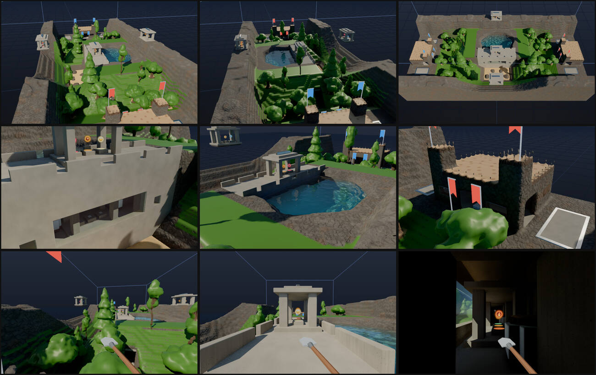

# Arenas

Handmade maps for team games (Big Team Battle: CTF, KOTH, siege, infection).
An arena is a **box preset** built in code from existing elements, at one fixed
grid size, because NPCs, spawners and the round modes only work in box grids.
Each one exports a **layout**: the points the modes and vehicles build against.

| Arena | Preset key | Grid | Builder |
| --- | --- | --- | --- |
| Dam Valley | `damValley` | `valley`: 256 × 96 × 128 | `src/arenas/damValley.js` |

Load one from the drawer's Scene row (**Dam Valley**), or `?preset=damValley`.
Picking it switches the grid to its own size; picking any other box scene
switches back to the box size from before. The arena grid isn't in the Grid
size row. Rounds reset the map with `__app.loadPreset('damValley', false)`:
the build is seeded, so every rebuild is the same, cell for cell.

While an arena is loaded, `__app.arena` is its layout (else `null`). The app also:
- puts **player spawners** at red's spawns, so F drops you into the red base;
- floats **perk orbs** over each shrine's plinths (`shrineAltars`);
- flies **team banners** (`src/arenas/markers.js`; no element is red or blue).



## Dam Valley

A long valley, mirrored end to end. Red holds the low-x end and blue the high-x
end. A river canyon crosses the middle and is dammed there: the reservoir lies
north of the dam (high z) and a dry spillway basin lies under its downstream face.

```
 z=127 ┌──────────────────────── north ridge (rock, y 46) ─────────── [shrine] ─────────────────────────┐
       │ RED plateau  │ forest on the     ╭──── RESERVOIR (water to y 31) ────╮    forest     │ BLUE plateau │
       │  y 22        │ abutment slope    │                                   │               │  y 22        │
       │ [fort]  flag │   ┄┄┄ trench ═════╪══ tunnel ══ pump room [shrine] ═══╪═════ ┄┄┄      │ flag  [fort] │
       │ spawn room   │                   ╞════ DAM crest y 34 [shrine] ══════╡               │  spawn room  │
       │ jeep pad     │ valley floor y 12 │  spillway basin y 6, boulders     │               │  jeep pad    │
 z=0   └──────────────────────── south ridge (rock, y 46) ─────────── [shrine] ─────────────────────────┘
       x=0                                                128                                     x=255
```

**Ways across the middle**
- **The dam's crest** (y 34): exposed, 16 wide, with waist-high parapets (gaps
  every 10 cells) and the crest shrine's pavilion in the middle as the only cover.
  You reach it from the abutments: rock plateaus at crest height on both
  sides of the reservoir, climbed by the forested slopes (grade 0.8, walkable).
- **The maintenance tunnel** (floor y 14, 6 wide, 9 high): close quarters, end
  to end through the abutments and the dam. Its approaches are open cuttings
  in the slopes. Glass slits in the dam's face light it every 12 cells. The
  **pump room** in the middle (28 × 12, 14 high) holds the second shrine.
- **The spillway basin** (y 6): the low way across, a sandy riverbed with
  boulders for cover and walkable banks.
- **Over the reservoir**: for anything that flies.
- **The ridges** (y 46): rock along both long sides, with faces too steep to
  walk (grade 2.8). They're for jetpacks, and each has a shrine in the middle.

**The bases** sit on plateaus 10 cells above the valley floor (y 22), each
ramped down to it at grade 0.5 (a jeep takes it). The fortress is 28 × 36: a
masonry floor, 2-thick **stone** (ROCK) walls 12 high, a **wooden** roof with
stone merlons, and two corner towers facing the enemy (7 square, 7 over the
roof). Glass window bands run along the hall and wooden shutters cover the
spawn room. There are doorways at the front and both sides. The spawn room at
the back has two doorways into the hall, and the flag stand (a 3 × 3 steel
plinth) is in the hall. Outside are a jeep pad (south) and two hoverbike pads
(north). The walls are destructible: bombs smash the wood and glass, and they
chip the stone.

**The forest** stands between each base and the dam, on a grass (PLANT) floor
that carries fire from tree to tree. The plateaus are bare rock, a firebreak:
a forest fire stops at the bases. The trees are the Tree construction's oaks,
birches and pines, seeded, and mirrored between the two sides.

**Blowing the dam.** The dam is indestructible masonry except for the pump
room's back wall. It has a wooden sluice gate at each end with the reservoir
behind it and a powder keg against it. Set a keg off (heat, fire, a bomb)
and the gate breaks: the reservoir pours into the pump room and runs out
along the tunnel toward both portals and the forests. The bases are out of
its reach. On the GPU, heating red's keg took out part of its gate, and
within 42 s 2010 cells of water had left the reservoir and filled the pump
room. No water rose to the plateaus.

### The layout (`DAM_VALLEY_LAYOUT`)

Grid cells. Points are **feet**: the first air cell over the ground or floor.
`yaw` follows the POV camera: 0 faces −z, π/2 faces −x, so red faces +x
(−π/2) and blue faces −x (π/2).

```js
{ name: 'Dam Valley', size: [256, 96, 128],
  spawns:   { red: 6 in red's spawn room, x 8 / 12, z 54 / 64 / 74, y 22;  blue: mirrored, x 247 / 243 },
  flags:    { red: [26, 23, 64], blue: [229, 23, 64] },          // on the steel stands
  hills:    [[128, 35, 64, 9],    // the crest, round its shrine
             [68, 24, 84, 9],     // red's forest
             [187, 24, 84, 9],    // blue's forest
             [128, 6, 41, 9],     // the spillway basin
             [128, 15, 64, 6]],   // the pump room
  siege:    { attackers: 'red', core: [234, 22, 64, 8] },        // blue's hall
  shrines:  [[128, 35, 60], [128, 15, 60], [128, 47, 7], [128, 47, 120]],   // crest, pump room, south ridge, north ridge (feet on the floor)
  vehicles: [jeep red [20, 22, 36], hoverbikes red [14, 22, 92] [26, 22, 92], and blue's mirrored at x 255 − x] }
```

Also exported: `ARENA_SIZE`, `buildDamValley()` (returns `{ ids, layout }`,
with ids a Uint8Array indexed `(y·nz + z)·nx + x`), `groundAt(x, z)`,
`shrineAltars(shrine)`, `DAM_VALLEY_BANNERS` and `DAM_VALLEY_PARTS` (the
gate, keg and reservoir positions for checks).

### Checks (`tools/arena-check.mjs`)

On the CPU, without a server (about a second):
- every layout point is standable (6 cells of air over footing) and every
  vehicle pad is flat and clear;
- every shrine altar is a steel-topped plinth;
- the reservoir is sealed (no water cell has air beside or under it);
- there is no loose powder (every grain's lower diagonals are filled), no
  plant touches water, and nothing is hot;
- the two halves mirror each other (except the shrines, which are an odd width);
- on foot from red's spawn you can reach blue's flag, every hill, the siege
  core, the crest and the pump room. The ridges can't be reached on foot, by
  design.

On the GPU (`--port <vite port> [--secs 30] [--shots dir] [--flood]`):
- `__app.arena`, the spawners and the 12 orbs are in place;
- the uploaded state is the CPU build, cell for cell;
- after 30 s of sim (about 2,200–3,250 steps) **0 cells have changed**, with no
  fire, smoke or steam, and the water count is steady (19,248);
- the step cost against 'wide' with the Lab (see below), the overview shots and
  a contact sheet, and with `--flood` the dam-blowing test above.

**Step cost** (ms per `sim.step()`, the median of 7 chunks of 40 steps, Apple
GPU, other sessions' work on the GPU. Each value is a range over three
samples):

| | Dam Valley, settled | wide 160 × 96 × 160 + Lab |
| --- | --- | --- |
| as run (sleeping supertiles skipped) | 1.0 – 5.6 | 8.7 – 11.3 |
| every supertile drawn | 2.5 – 19.2 | 9.3 – 15.5 |
| every brick stepped (worst case) | 15.8 – 27.0 | 16.1 – 23.6 |

The valley has 1.28× wide's cells. When fully awake it costs 0.8–1.15× as
much, inside the 1.5× budget. Settled, it costs less than the Lab, because a
finished map sleeps.

### Follow-ups
- Water in the tunnel takes over 40 s to reach the portals. A wider gate, or
  a second charge, would make the flood faster and more dramatic.
- The tunnel is dark between the window slits. Light sources would help.
- Vehicles: the abutment slopes (grade 0.8) are walkable but steep for a
  jeep. The jeep's route is the valley floor and the basin.
- The arena's grid isn't offered in the Grid size row, by design. A
  multiplayer guest gets it from the host's dims (`SIZES.valley`), but not
  `__app.arena`.
